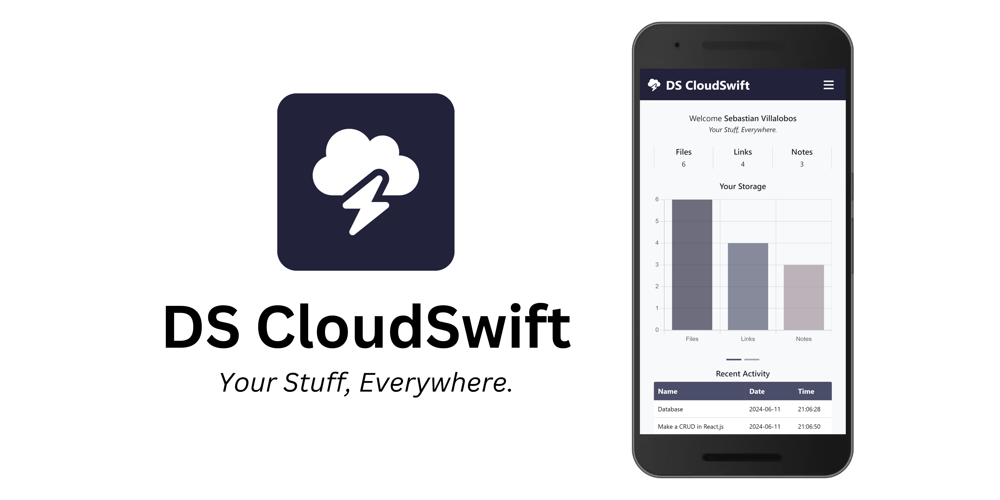
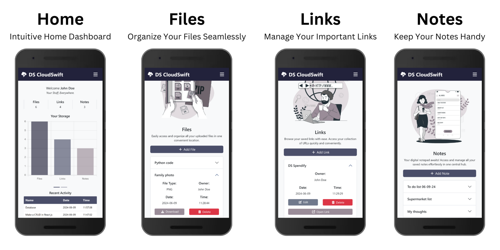

# DS CloudSwift

## _Your Stuff, Everywhere._

DS CloudSwift is your ultimate solution for easy, fast, and secure cloud storage. With DS CloudSwift, you can seamlessly save, organize, and access your files, links, and notes from any device. Enjoy the freedom of having "Your Stuff, Everywhere" and elevate your cloud storage experience like never before.

### Key Features

- User-Friendly Interface.
- Cross-Device Compatibility.
- Simplified Cloud Storage.
- Secure Data Storage.

### Screenshots

### Software Design Documentation

Discover the core architecture and design principles behind the application. The Software Design Documentation delivers an in-depth look into the inner workings, providing a thorough understanding of DS CloudSwift's structure.

[DS CloudSwift SDD](https://1drv.ms/f/s!Ailusu2OkHmZhokEaACA3ipBIubgvQ?e=7aQwSP)

### Release Notes

###### DS CloudSwift Version 1.0.9

- Bug fixes.
